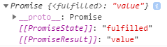

# async & await

Async & await is a syntactical sugar for the promise.

## Points to Remember

1. Async function always returns a promise.

```javascript
async function functionName(){
    return "value";
}
functionName()
```


