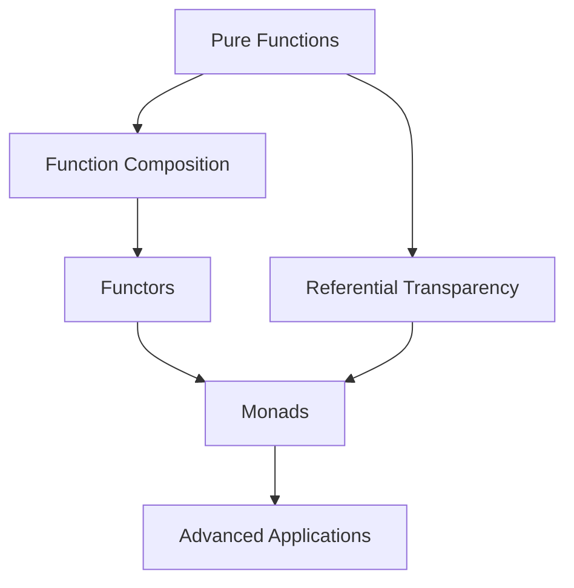

# 🚀 Functional Programming - Quick Start Guide

## How to Use This Guide

This comprehensive functional programming guide is designed to take you from beginner to expert level. Here's how to get the most out of it:

### 📖 Reading Order

1. **Start with the main README.md** - Get an overview of functional programming
2. **Follow the numbered folders** in order:
   - `01. Pure Function & Side Effect/` - Foundation concepts
   - `02. function & composition/` - Building complexity from simplicity  
   - `03. Functor Functions/` - Working with containers
   - `04. Monads/` - Advanced pattern mastery
   - `05. Referential Programming/` - Mathematical foundations

### 🏃‍♂️ Quick Start

```bash
# Navigate to any folder and run the exercises
cd "Pure Function & Side Effect"
node exercises.js

# Or run them in your browser console
# Copy and paste the exercise code
```

### 📂 Folder Structure

```
Functional Programming/
├── README.md (Main guide with advanced topics)
│
├── Pure Function & Side Effect/
│   ├── README.md (Deep dive into pure functions)
│   └── exercises.js (Practical exercises)
│
├── function & composition/
│   ├── README.md (Function composition mastery)
│   └── exercises.js (Composition exercises)
│
├── Functor Functions/
│   ├── README.md (Understanding functors)
│   └── exercises.js (Functor implementations)
│
├── Monads/
│   ├── README.md (Monad patterns and applications)
│   └── exercises.js (Monadic programming)
│
├── Referential Programming/
│   ├── README.md (Mathematical foundations)
│   └── exercises.js (RT property testing)
│
└── GETTING_STARTED.md (This file)
```

## 🎯 Learning Paths

### 👶 **Beginner Path** (2-3 weeks)
- Read: Pure Functions & Side Effects README
- Practice: Pure Functions exercises  
- Read: Function & Composition README (first half)
- Practice: Basic composition exercises
- Read: Referential Transparency README (first half)

### 🎓 **Intermediate Path** (4-6 weeks)
- Complete Beginner Path
- Read: Complete Function & Composition README
- Practice: All composition exercises including currying
- Read: Functor Functions README
- Practice: Maybe and Either functor exercises
- Read: Complete Referential Transparency README

### 🧙‍♂️ **Advanced Path** (8-12 weeks)
- Complete Intermediate Path
- Read: Complete Monads README
- Practice: All monad exercises including State and IO
- Study: Advanced topics in main README
- Build: Real-world project using FP principles

## 💡 Exercise Instructions

Each folder contains an `exercises.js` file with hands-on coding exercises:

### Running Exercises

**Option 1: Node.js**
```bash
node exercises.js
```

**Option 2: Browser Console**
1. Open browser developer tools (F12)
2. Copy the exercise code
3. Paste and run in console

**Option 3: Online REPL**
- Copy code to repl.it, CodePen, or similar
- Run and experiment

### Exercise Format
- Each exercise builds on previous concepts
- Code is heavily commented with explanations  
- Examples show both ❌ wrong and ✅ correct approaches
- Real-world applications demonstrate practical usage

## 🔧 Practical Applications

### Web Development
```javascript
// Redux-style state management
const reducer = (state, action) => {
    switch(action.type) {
        case 'ADD_TODO':
            return { ...state, todos: [...state.todos, action.todo] };
        default:
            return state;
    }
};

// API data processing
const processApiData = pipe(
    validateResponse,
    normalizeData,
    transformData,
    cacheResult
);
```

### Data Processing
```javascript
// ETL pipeline
const processCSV = pipe(
    parseCSV,
    filterValidRows,
    transformColumns,
    aggregateData,
    formatOutput
);
```

### Form Validation
```javascript
// Validation pipeline
const validateForm = formData =>
    validateRequired(formData)
        .flatMap(validateEmail)
        .flatMap(validatePassword)
        .fold(
            errors => ({ valid: false, errors }),
            data => ({ valid: true, data })
        );
```

## 📚 Additional Resources

### Books
- "Functional Programming in JavaScript" by Luis Atencio
- "Professor Frisby's Mostly Adequate Guide to Functional Programming"
- "Functional-Light JavaScript" by Kyle Simpson

### Online Resources
- [Fantasy Land Specification](https://github.com/fantasyland/fantasy-land)
- [Ramda.js](https://ramdajs.com/) - Practical functional library
- [Folktale](https://folktale.origamitower.com/) - FP data structures

### Practice Projects

1. **Todo App with FP**: Build using pure functions and immutable state
2. **Data Visualization**: Process and transform data functionally  
3. **Form Builder**: Create reusable validation and transformation pipelines
4. **Chat Application**: Handle side effects with IO monads
5. **Configuration System**: Use Reader monad for dependency injection

## 🤔 Common Questions

### "Is functional programming practical in JavaScript?"
Yes! Modern JavaScript supports FP patterns well:
- Array methods (map, filter, reduce)
- Arrow functions and closures
- Immutable operations with spread syntax
- Libraries like Ramda and Immutable.js

### "Should I avoid all side effects?"
No, isolate them:
- Keep business logic pure
- Handle side effects at boundaries (IO monad)
- Use pure functions for transformations
- Test pure functions easily

### "When should I use monads?"
- Maybe: Null safety
- Either: Error handling
- IO: Side effect management
- State: Stateful computations
- Reader: Dependency injection

### "How do I convince my team?"
- Start small with pure utility functions
- Show improved testability
- Demonstrate bug reduction
- Use familiar patterns (Redux uses FP)
- Gradual adoption, not revolution

## 🎉 Getting Help

1. **Read the comments** in exercise files
2. **Follow the examples** step by step
3. **Experiment** with variations
4. **Build something** using the concepts
5. **Join communities** (Reddit r/functionalprogramming, Discord servers)

## 🏆 Mastery Checklist

### Foundation ✅
- [ ] Understand pure functions vs impure
- [ ] Can identify side effects
- [ ] Practice immutable updates
- [ ] Write testable functions

### Composition ✅
- [ ] Compose simple functions
- [ ] Understand pipe vs compose
- [ ] Apply currying and partial application
- [ ] Use higher-order functions

### Functors ✅
- [ ] Implement basic functors
- [ ] Use Maybe for null safety
- [ ] Handle errors with Either
- [ ] Understand functor laws

### Monads ✅
- [ ] Chain computations with flatMap
- [ ] Handle context preservation
- [ ] Apply appropriate monad types
- [ ] Compose monadic operations

### Theory ✅
- [ ] Understand referential transparency
- [ ] Apply equational reasoning
- [ ] Recognize optimization opportunities
- [ ] Connect theory to practice

## 🚀 Ready to Start?

1. Begin with `Pure Function & Side Effect/README.md`
2. Work through the exercises
3. Build something real
4. Share your progress!

*Happy functional programming! 🎉*


# 🔄 Functional Programming Mastery

> *A comprehensive, in-depth guide to functional programming concepts, principles, and advanced techniques*

## 📋 Table of Contents

- [Introduction to Functional Programming](#introduction-to-functional-programming)
- [Core Concepts](#core-concepts)
- [Benefits of Functional Programming](#benefits-of-functional-programming)
- [Folder Structure](#folder-structure)
- [Key Principles](#key-principles)
- [Advanced Topics](#advanced-topics)
- [Real-World Applications](#real-world-applications)
- [Performance Considerations](#performance-considerations)
- [Getting Started](#getting-started)

## Introduction to Functional Programming

Functional Programming (FP) is a programming paradigm that treats computation as the evaluation of mathematical functions and avoids changing state and mutable data. Unlike imperative programming that focuses on **how** to do things, functional programming emphasizes **what** to do.

### 🌟 **Historical Context**
- Originated from lambda calculus (Alonzo Church, 1930s)
- Languages like LISP (1958) pioneered FP concepts
- Modern resurgence due to multi-core processors and distributed systems

### 🎯 **Core Philosophy**
Functional programming promotes writing code that is:

- **Immutable** - Data structures don't change after creation
- **Pure** - Functions produce the same output for the same input
- **Declarative** - Focus on what to do, not how to do it
- **Composable** - Functions can be combined to create complex operations
- **Mathematical** - Based on mathematical function principles
- **Predictable** - Easier to reason about and debug

### 💻 **JavaScript and Functional Programming**
JavaScript is a multi-paradigm language that supports:
- First-class functions
- Higher-order functions
- Closures
- Immutable operations (with proper techniques)
- Function composition

## Core Concepts

### 🎯 **Pure Functions**
Functions that:
- Always return the same output for the same input (deterministic)
- Have no side effects (don't modify external state)
- Don't depend on external mutable state
- Are testable and predictable

```javascript
// Pure function
const multiply = (a, b) => a * b;

// Impure function (depends on external state)
let tax = 0.1;
const calculatePrice = (price) => price + (price * tax); // ❌

// Pure version
const calculatePricePure = (price, taxRate) => price + (price * taxRate); // ✅
```

### 🔄 **Function Composition**
The process of combining simple functions to build more complex ones. It's the heart of functional programming.

```javascript
const compose = (...fns) => (value) => fns.reduceRight((acc, fn) => fn(acc), value);
const pipe = (...fns) => (value) => fns.reduce((acc, fn) => fn(acc), value);

const addOne = x => x + 1;
const double = x => x * 2;
const square = x => x * x;

// Composition (right to left)
const addOneThenDoubleSquare = compose(square, double, addOne);
console.log(addOneThenDoubleSquare(3)); // (3+1)*2^2 = 64

// Pipe (left to right - more readable)
const pipeline = pipe(addOne, double, square);
console.log(pipeline(3)); // ((3+1)*2)^2 = 64
```

### 🎭 **Functors**
Objects that implement a `map` method, allowing you to apply functions to values within a context without unwrapping them.

```javascript
class Container {
  constructor(value) {
    this.value = value;
  }
  
  map(fn) {
    return new Container(fn(this.value));
  }
  
  static of(value) {
    return new Container(value);
  }
}

// Usage
Container.of(5)
  .map(x => x + 1)
  .map(x => x * 2)
  .map(x => `Result: ${x}`);
// Container { value: "Result: 12" }
```

### 🏗️ **Monads**
Design patterns that provide a way to wrap values and chain operations on those wrapped values, handling context and side effects elegantly.

```javascript
class Maybe {
  constructor(value) {
    this.value = value;
  }
  
  static of(value) {
    return new Maybe(value);
  }
  
  isNull() {
    return this.value === null || this.value === undefined;
  }
  
  map(fn) {
    return this.isNull() ? Maybe.of(null) : Maybe.of(fn(this.value));
  }
  
  flatMap(fn) {
    return this.isNull() ? Maybe.of(null) : fn(this.value);
  }
}

// Safe operations with null checking
const safeDiv = (a, b) => b === 0 ? Maybe.of(null) : Maybe.of(a / b);

Maybe.of(10)
  .flatMap(x => safeDiv(x, 2))
  .map(x => x * 3)
  .map(x => `Result: ${x}`);
```

### 🔒 **Referential Transparency**
The ability to replace an expression with its value without changing program behavior. This makes code predictable and enables powerful optimizations.

```javascript
// Referentially transparent
const add = (a, b) => a + b;
const x = add(2, 3); // Can always be replaced with 5

// Not referentially transparent
let counter = 0;
const increment = () => ++counter; // Returns different values each call
```

### 🔗 **Higher-Order Functions**
Functions that either take other functions as arguments or return functions as results.

```javascript
// Takes function as argument
const filter = (predicate, array) => array.filter(predicate);

// Returns function
const createMultiplier = (factor) => (value) => value * factor;
const double = createMultiplier(2);
const triple = createMultiplier(3);

// Combines both
const createValidator = (rules) => (data) => 
  rules.every(rule => rule(data));
```

## Benefits of Functional Programming

| Benefit | Description | Example |
|---------|-------------|---------|
| 🐛 **Fewer Bugs** | Immutability and pure functions reduce unexpected behavior | No surprise mutations or side effects |
| 🧪 **Easier Testing** | Pure functions are predictable and easy to unit test | Same input always produces same output |
| 🔄 **Reusability** | Functions can be composed and reused in different contexts | Higher-order functions and composition |
| ⚡ **Parallelization** | No shared mutable state makes parallel processing safer | Map-reduce operations can run in parallel |
| 🧠 **Reasoning** | Easier to understand and reason about code behavior | Mathematical foundations provide clarity |
| 🔧 **Debugging** | Stack traces are cleaner, state is predictable | Pure functions isolate problems |
| 📊 **Performance** | Optimizations like memoization and lazy evaluation | Caching results of pure functions |
| 🛡️ **Error Handling** | Elegant error handling with monads and functors | Maybe and Either types handle failures gracefully |

### 📊 **Performance Benefits**

```javascript
// Memoization - Cache results of expensive pure functions
const memoize = (fn) => {
  const cache = new Map();
  return (...args) => {
    const key = JSON.stringify(args);
    if (cache.has(key)) {
      return cache.get(key);
    }
    const result = fn(...args);
    cache.set(key, result);
    return result;
  };
};

// Expensive fibonacci calculation
const fib = memoize((n) => {
  if (n <= 1) return n;
  return fib(n - 1) + fib(n - 2);
});

// Lazy evaluation - Only compute when needed
const lazyRange = function* (start, end) {
  for (let i = start; i < end; i++) {
    yield i;
  }
};

const numbers = lazyRange(1, 1000000);
const firstFive = Array.from(numbers).slice(0, 5); // Only computes first 5
```

## Folder Structure

This comprehensive guide is organized into focused sections that build upon each other:

### 📁 [01. Pure Function & Side Effect](./Pure%20Function%20&%20Side%20Effect/)
**Foundation Level** - Master the fundamental building blocks of functional programming
- Understanding pure functions vs impure functions
- Identifying and eliminating side effects
- Immutability techniques and best practices
- Real-world examples and anti-patterns

### 📁 [02. Function & Composition](./function%20&%20composition/)
**Intermediate Level** - Learn to combine functions to create powerful abstractions
- First-class functions in JavaScript
- Function composition patterns and techniques
- Pipe and compose utilities
- Currying and partial application
- Point-free programming style

### 📁 [03. Functor Functions](./Functor%20Functions/)
**Advanced Level** - Understanding functors and mappable structures
- Container types and the map operation
- Built-in JavaScript functors (Array, Promise)
- Custom functor implementations
- Maybe and Either functors for error handling
- Functor laws and properties

### 📁 [04. Monads](./Monads/)
**Expert Level** - Deep dive into monads and their applications
- Understanding the monad pattern
- Identity, Maybe, IO, and State monads
- Monadic composition and chaining
- Real-world applications in JavaScript
- Error handling with monadic patterns

### 📁 [05. Referential Programming](./Referential%20Programming/)
**Theoretical Foundation** - Mathematical foundations and formal reasoning
- Referential transparency and substitutability
- Lambda calculus foundations
- Equational reasoning about programs
- Optimization opportunities
- Category theory connections

### 🎯 **Learning Path Recommendations**



**Beginner**: Start with Pure Functions → Function Composition → Referential Transparency
**Intermediate**: Add Functors and basic monads
**Advanced**: Master all monad types and category theory concepts

## Key Principles

### 1. **Immutability**
```javascript
// Avoid
let arr = [1, 2, 3];
arr.push(4); // Mutates original array

// Prefer
const arr = [1, 2, 3];
const newArr = [...arr, 4]; // Creates new array
```

### 2. **Pure Functions**
```javascript
// Pure function
const add = (a, b) => a + b;

// Impure function (side effect)
let counter = 0;
const increment = () => ++counter;
```

### 3. **Function Composition**
```javascript
const compose = (f, g) => (x) => f(g(x));
const addOne = x => x + 1;
const double = x => x * 2;

const addOneThenDouble = compose(double, addOne);
```

## Getting Started

1. **📖 Start with Pure Functions**: Learn to write functions without side effects
2. **🔄 Practice Composition**: Combine simple functions to create complex behaviors
3. **🎭 Explore Functors**: Understand how to work with wrapped values
4. **🏗️ Study Monads**: Learn advanced patterns for handling complex data flows
5. **🔒 Apply Referential Transparency**: Write code that can be reasoned about mathematically

## Advanced Topics

### 🚀 **Transducers**
Composable and efficient data transformation abstractions that work with any data structure.

```javascript
// Basic transducer implementation
const map = (transform) => (reducing) => (result, input) => 
  reducing(result, transform(input));

const filter = (predicate) => (reducing) => (result, input) => 
  predicate(input) ? reducing(result, input) : result;

// Composable transformations
const xform = pipe(
  map(x => x * 2),
  filter(x => x > 10),
  map(x => `Value: ${x}`)
);

// Works with any collection type
const numbers = [1, 2, 3, 4, 5, 6, 7, 8, 9, 10];
const result = numbers.reduce(xform((acc, val) => [...acc, val]), []);
```

### 🔮 **Lenses and Optics**
Functional way to access and modify deeply nested data structures immutably.

```javascript
// Simple lens implementation
const lens = (getter, setter) => ({ get: getter, set: setter });

const prop = (key) => lens(
  obj => obj[key],
  (val, obj) => ({ ...obj, [key]: val })
);

const path = (keys) => keys.reduce((acc, key) => 
  lens(
    obj => acc.get(obj)?.[key],
    (val, obj) => acc.set({...acc.get(obj), [key]: val}, obj)
  )
);

// Usage
const user = {
  name: 'John',
  address: { street: '123 Main St', city: 'Boston' }
};

const cityLens = path(['address', 'city']);
const newUser = cityLens.set('New York', user);
```

### ⚡ **Lazy Evaluation**
Deferring computation until the result is actually needed.

```javascript
class LazySequence {
  constructor(generator) {
    this.generator = generator;
  }
  
  static of(iterable) {
    return new LazySequence(function* () {
      yield* iterable;
    });
  }
  
  map(fn) {
    const generator = this.generator;
    return new LazySequence(function* () {
      for (const item of generator()) {
        yield fn(item);
      }
    });
  }
  
  filter(predicate) {
    const generator = this.generator;
    return new LazySequence(function* () {
      for (const item of generator()) {
        if (predicate(item)) yield item;
      }
    });
  }
  
  take(count) {
    const generator = this.generator;
    return new LazySequence(function* () {
      let taken = 0;
      for (const item of generator()) {
        if (taken >= count) break;
        yield item;
        taken++;
      }
    });
  }
  
  toArray() {
    return Array.from(this.generator());
  }
}

// Infinite sequence - only computes what's needed
const infiniteNumbers = LazySequence.of(function* () {
  let i = 0;
  while (true) yield i++;
}());

const result = infiniteNumbers
  .filter(x => x % 2 === 0)
  .map(x => x * 2)
  .take(5)
  .toArray(); // [0, 4, 8, 12, 16]
```

## Real-World Applications

### 🌐 **Data Processing Pipeline**
```javascript
// Functional data processing
const processUserData = pipe(
  validateInput,
  normalizeData,
  enrichWithMetadata,
  transformToOutput,
  logResult
);

const users = [/* user data */];
const processedUsers = users.map(processUserData);
```

### 🔄 **State Management (Redux-like)**
```javascript
// Functional state updates
const reducer = (state, action) => {
  switch (action.type) {
    case 'ADD_ITEM':
      return {
        ...state,
        items: [...state.items, action.payload]
      };
    case 'UPDATE_ITEM':
      return {
        ...state,
        items: state.items.map(item => 
          item.id === action.id 
            ? { ...item, ...action.updates }
            : item
        )
      };
    default:
      return state;
  }
};
```

### 🧪 **API Error Handling**
```javascript
// Functional error handling with Either monad
const fetchUserData = async (userId) => {
  try {
    const response = await fetch(`/api/users/${userId}`);
    const data = await response.json();
    return Either.right(data);
  } catch (error) {
    return Either.left(error.message);
  }
};

const processUser = (userId) =>
  fetchUserData(userId)
    .map(validateUser)
    .map(enrichUserData)
    .map(formatOutput)
    .mapLeft(logError);
```

## Performance Considerations

### ⚡ **When to Use Functional Programming**
- **Good for**: Data transformation, mathematical computations, predictable operations
- **Consider carefully for**: High-performance applications, real-time systems, memory-constrained environments

### 📊 **Optimization Techniques**
```javascript
// Structural sharing with Immutable.js
import { Map, List } from 'immutable';

const originalData = Map({ 
  users: List([{ name: 'John' }, { name: 'Jane' }])
});

// Efficient immutable update - shares structure
const updatedData = originalData.updateIn(['users', 0, 'name'], () => 'Johnny');

// Tail call optimization (where supported)
const factorial = (n, acc = 1) => 
  n <= 1 ? acc : factorial(n - 1, n * acc);

// Trampolining for stack safety
const trampoline = (fn) => {
  while (typeof fn === 'function') {
    fn = fn();
  }
  return fn;
};

const factorialTrampoline = (n, acc = 1) => 
  n <= 1 ? acc : () => factorialTrampoline(n - 1, n * acc);
```
